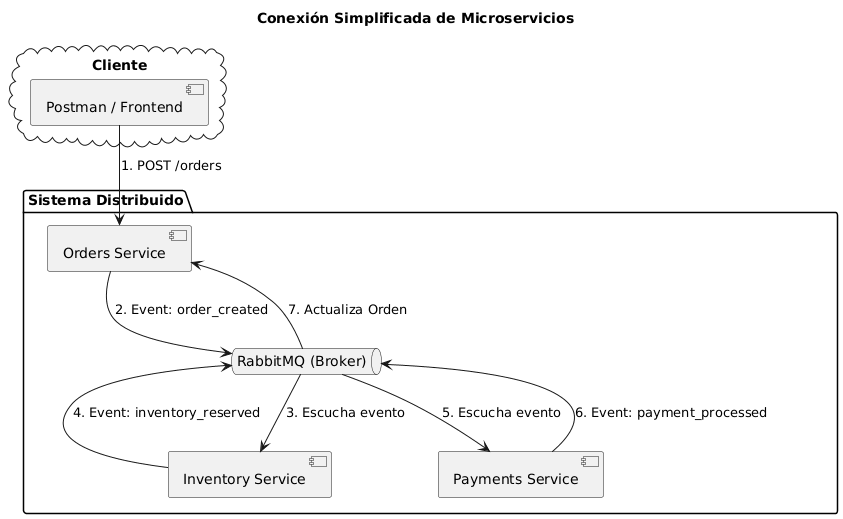

# Sistema de Órdenes Distribuido (Saga Pattern)

Este proyecto implementa una arquitectura de microservicios utilizando **NestJS**, **RabbitMQ** y **PostgreSQL**, aplicando el patrón **Saga** para garantizar la consistencia eventual entre los servicios de Órdenes, Inventario y Pagos.

---

## 🚀 Instrucciones de Ejecución

### 1. Requisitos Previos
* **Node.js** (v18 o superior)
* **Docker** y **Docker Compose**
* **PostgreSQL** y **RabbitMQ** (pueden ser locales o vía Docker)

### 2. Infraestructura con Docker
Levanta las bases de datos y el broker de mensajería:
```bash
docker-compose up -d


```

### 3. Instalación de Dependencias
```bash

npm install

```

### 4. Iniciar Microservicios

```bash
# Terminal 1: Servicio de Órdenes
npm run start:dev orders-service

# Terminal 2: Servicio de Inventario
npm run start:dev inventory-service

# Terminal 3: Servicio de Pagos
npm run start:dev payments-service
```


# Comandos de Test

## Tests Unitarios
```bash
# Ejecutar todos los tests del monorepo
npm run test

# Test de un servicio específico
npm run test orders-service
npm run test inventory-service
npm run test payments-service


```

## Tests de Integración (E2E)
```bash
npm run test:e2e

```

## Cobertura (Coverage)

```bash
npm run test:cov

```

## 🛠️ Tecnologías Principales

* **NestJS**: Framework de backend modular y escalable para Node.js.
* **RabbitMQ**: Message Broker basado en el protocolo AMQP para la comunicación asíncrona entre microservicios.
* **TypeORM**: ORM potente para el mapeo de datos y gestión de la base de datos **PostgreSQL**.
* **Swagger**: Documentación interactiva de la API crear orden (disponible en: `http://localhost:3001/api`)
agregar inventario orden (disponible en: `http://localhost:3002api`)
.


## 📊 Arquitectura y Flujo (Saga Pattern)

El sistema utiliza la **coreografía de eventos** para gestionar transacciones distribuidas y asegurar la consistencia entre servicios.

🔗 **[Diagrama de Flujo del Sistema (Mermaid)](image.png)**


### ⚙️ Secuencia de Eventos

1. **Orders Service**: 
   - Recibe la solicitud vía REST.
   - Registra la orden en la base de datos con estado `PENDING`.
   - Emite el evento `order_created` hacia RabbitMQ.

2. **Inventory Service**: 
   - Escucha el evento `order_created`.
   - Valida y reserva el stock solicitado.
   - Emite el evento `inventory_reserved`.
   - ⚠️ **Compensación**: Si el stock es insuficiente, emite `inventory_failed`. El **Orders Service** escucha este evento y actualiza la orden a `CANCELLED`.

3. **Payments Service**: 
   - Escucha el evento `inventory_reserved`.
   - Procesa el cobro de la transacción.
   - Emite el evento `payment_processed`.

4. **Orders Service (Finalización)**: 
   - Escucha el evento `payment_processed`.
   - Actualiza el estado final de la orden a `CONFIRMED`.


   